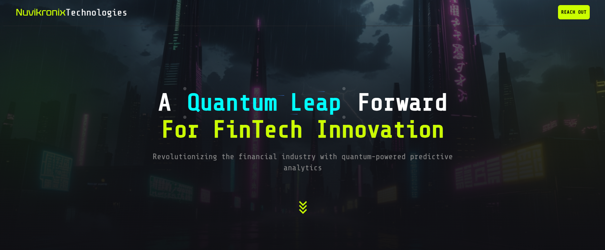
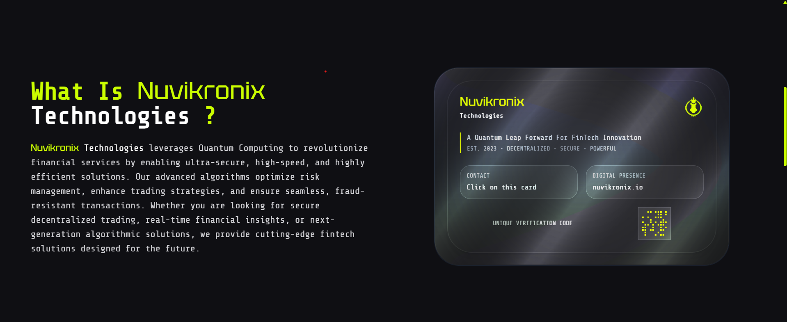

# 🏛 **Nuvikronix Technologies Website**

🌍 **A cutting-edge web platform for Nuvikronix Technologies**, showcasing their revolutionary quantum computing solutions for the fintech industry. The website serves as a digital portal for their services, technological innovations, and industry leadership in quantum-powered financial technology.

✨Access the [live link](https://nuvikronix.vercel.app) here. 

---

## 🔥 **Key Features**

✅ **Interactive UI Elements** – Modern design with responsive components and animations. 

✅ **Service Portfolio** – Exploration of quantum computing applications in finance. 

✅ **Contact Integration** – Streamlined communication channels for potential clients.

---

## 📸 **Screenshots**

|           Screenshots           |
| ------------------------------- |
|      |
|  |
|      |


---

## 🛠 **Tech Stack**

- **Frontend:** Next.js + Tailwind CSS 🚀
- **Animations:** Framer Motion 🎭
- **Styling:** Custom UI Components with CSS Modules 🎨

---

## 🚀 **Getting Started**

### 1️⃣ **Clone the Repository**

```sh
git clone https://github.com/aaqibhakeem/hyperion.git
cd hyperion
```

### 2️⃣ **Install Dependencies**

```sh
npm install
```

### 3️⃣ **Run the Development Server**

```sh
npm run dev
```

_(The app will be live at `http://localhost:3000`)_

---

## 📝 License

Distributed under the MIT License. See [LICENSE](LICENSE) for more information.

---

## 🆘 Support

Having trouble? Want to request a feature? Here's how you can get help:

- Open an issue.
- Contact the maintainer: [Aaqib Hakeem](https://aaqibhakeem.vercel.app/)

---

**🌟 Developed to showcase the future of quantum computing in financial technology! 💹** 
